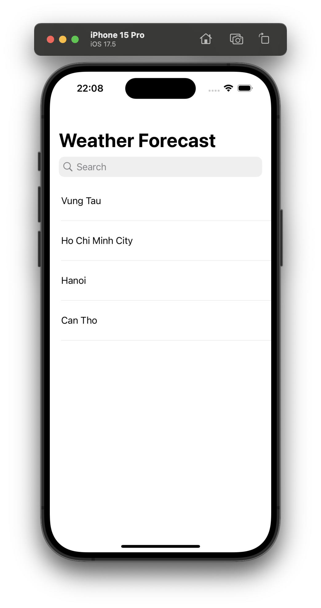
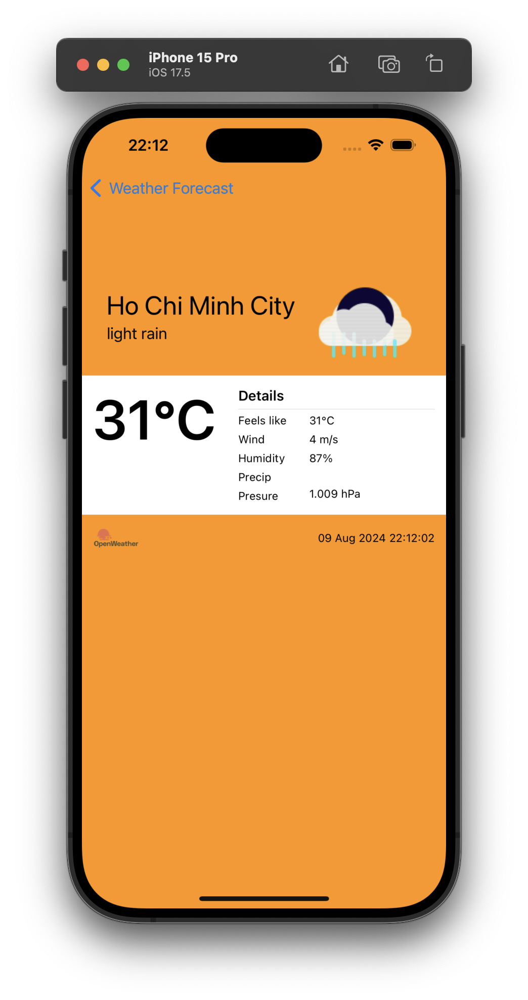

# Weather Forecast

A simple Weather Forecast application that says "Hello" to the whole world!

# Description

This app will display weather information for a selected
city, fetched from a public API, and will allow users to save their favourite cities using a local
database.

# Getting started

1. Make sure you have the Xcode version 15.0 or above installed on your computer. 
2. Download the Weather Forecast project files from the repository. 
3. Install CocoaPods. 
4. Run pod install so you can install the dependencies in your project. 
5. Open the project files in Xcode. 
6. Review the code and make sure you understand what it does. 
7. Run the active scheme. 

# Screenshot

  
  

# Dependencies

[CocoaPods](https://cocoapods.org) is used as a dependency manager.
List of dependencies:

- pod 'RealmSwift' -> Realm is a mobile database that runs directly inside phones, tablets or wearables.

# API

- We are using a REST API
- List of API calls is [here](https://openweathermap.org/current)
- Use URLSession to make network
  requests to the OpenWeatherMap API.
- Parse JSON data using Codable
